# Architecture Diagram

> Generated by the `diagram-generator` agent from the prose docs in `docs/atdd/architecture/`. Overwritten on every run — do not edit by hand; edit the source docs and regenerate.

## Source docs

- `docs/atdd/architecture/driver-adapter.md`
- `docs/atdd/architecture/driver-port.md`
- `docs/atdd/architecture/dsl-core.md`
- `docs/atdd/architecture/dsl-port.md`
- `docs/atdd/architecture/test.md`

## Diagram

```mermaid
flowchart TD
    POSITIVE_TEST[UseCase PositiveTest]
    NEGATIVE_TEST[UseCase NegativeTest]

    subgraph DSL_PORT_SG[DSL Port]
        GIVEN_STAGE[GivenStage]
        WHEN_STAGE[WhenStage]
        THEN_STAGE[ThenStage]
        THEN_RESULT_STAGE[ThenResultStage]
        THEN_STEP[ThenStep TThen]
        THEN_SUCCESS[ThenSuccess]
        THEN_FAILURE[ThenFailure]
    end

    subgraph DSL_CORE_SG[DSL Core]
        GIVEN_IMPL[Given step classes]
        WHEN_IMPL[When step classes - e.g. WhenPlaceOrderImpl]
        THEN_IMPL[Then step classes]
        VERIFICATION[Verification classes - e.g. PlaceOrderVerification]
        USE_CASE[Use case classes - usecase/external + usecase/shop]
    end

    subgraph DRIVER_PORT_SG[Driver Port]
        DRIVER_PORT_EXTERNAL[driver-port/external - clock, erp, tax]
        DRIVER_PORT_SHOP[driver-port/shop - api, ui]
    end

    subgraph DRIVER_ADAPTER_SG[Driver Adapter]
        BASE_DRIVER[BaseXyzDriver]
        REAL_DRIVER[XyzRealDriver]
        STUB_DRIVER[XyzStubDriver]
        BASE_CLIENT[BaseXyzClient]
        REAL_CLIENT[XyzRealClient]
        STUB_CLIENT[XyzStubClient]
        SHOP_API_CLIENT[ShopApiClient]
        CONTROLLERS[OrderController / CouponController / ProductController]
        SYSTEM_ERROR_MAPPER[SystemErrorMapper]
        UI_DRIVER[Shop UI Driver - page objects + page state enum]
    end

    EXT_REQ[Ext Request DTOs - string fields only]
    EXT_RES[Ext Response DTOs - typed fields allowed]
    PROBLEM_DETAIL[ProblemDetailResponse]
    ERROR_RESPONSE[domain ErrorResponse]

    REAL_SERVICE[Real external service via HTTP]
    WIREMOCK[WireMock stubs]
    SHOP_API[Shop API]
    SHOP_UI[Shop UI - home page + clicks]

    POSITIVE_TEST -->|asserts shouldSucceed via| DSL_PORT_SG
    NEGATIVE_TEST -->|asserts shouldFailWith via| DSL_PORT_SG

    GIVEN_STAGE -->|and / when / then| WHEN_STAGE
    GIVEN_STAGE -->|then transitions to| THEN_STAGE
    WHEN_STAGE -->|then transitions to| THEN_STAGE
    THEN_RESULT_STAGE -->|extends| THEN_STAGE
    THEN_RESULT_STAGE -->|shouldSucceed| THEN_SUCCESS
    THEN_RESULT_STAGE -->|shouldFail| THEN_FAILURE
    THEN_SUCCESS -->|extends| THEN_STEP
    THEN_FAILURE -->|extends| THEN_STEP
    THEN_SUCCESS -->|and navigates to| THEN_IMPL

    GIVEN_IMPL -.implements.-> GIVEN_STAGE
    WHEN_IMPL -.implements.-> WHEN_STAGE
    THEN_IMPL -.implements.-> THEN_STAGE
    THEN_IMPL -.implements.-> THEN_RESULT_STAGE

    GIVEN_IMPL -->|with FieldName setters| USE_CASE
    WHEN_IMPL -->|alias e.g. DEFAULT_ORDER_NUMBER| USE_CASE
    THEN_IMPL -->|delegates assertions to| VERIFICATION

    USE_CASE -->|calls methods on| DRIVER_PORT_SG

    DRIVER_PORT_EXTERNAL -.implemented by.-> BASE_DRIVER
    DRIVER_PORT_SHOP -.implemented by.-> SHOP_API_CLIENT
    DRIVER_PORT_SHOP -.implemented by.-> UI_DRIVER

    REAL_DRIVER -->|delegates to| BASE_DRIVER
    STUB_DRIVER -->|delegates to| BASE_DRIVER
    BASE_DRIVER -->|delegates to| BASE_CLIENT
    REAL_CLIENT -->|extends| BASE_CLIENT
    STUB_CLIENT -->|extends| BASE_CLIENT

    REAL_CLIENT -->|createProduct via real HTTP using| EXT_REQ
    REAL_CLIENT -->|deserializes| EXT_RES
    REAL_CLIENT -->|HTTP| REAL_SERVICE
    STUB_CLIENT -->|configureGetProduct registers| WIREMOCK

    SHOP_API_CLIENT -->|composes| CONTROLLERS
    CONTROLLERS -->|HTTP| SHOP_API
    SHOP_API -->|returns| PROBLEM_DETAIL
    PROBLEM_DETAIL -->|mapped by| SYSTEM_ERROR_MAPPER
    SYSTEM_ERROR_MAPPER -->|exposes| ERROR_RESPONSE

    UI_DRIVER -->|aria-label selectors, role=alert notifications| SHOP_UI

    BASE_DRIVER -->|goTo Xyz health check in Assume stage| REAL_SERVICE
```

## Notes

The architecture prose describes a single component-dependency view; no separate runtime call-flow view is rendered. The diagram preserves the source naming conventions (`Ext*` DTO prefix, `BaseXyzDriver`/`BaseXyzClient`, `external/` vs `shop/` driver split) and reflects rules without inventing layers — for example, `Ext*Request` vs request DTO field-typing rules are surfaced as edge labels rather than as a separate node.
