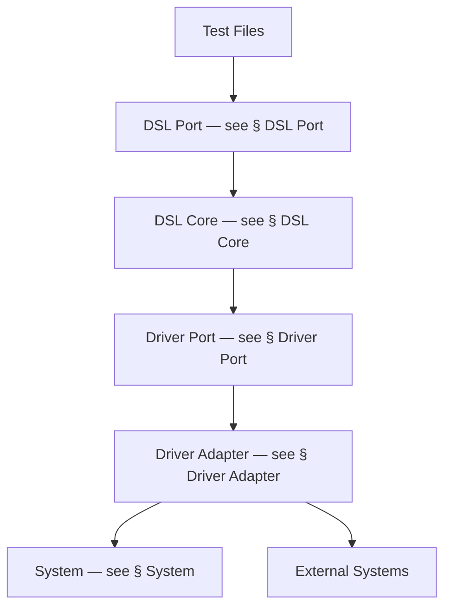
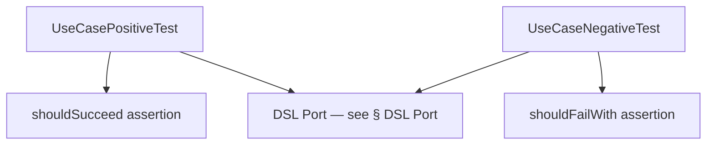
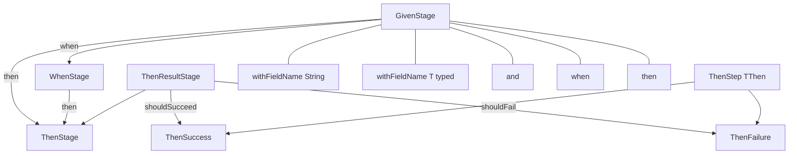
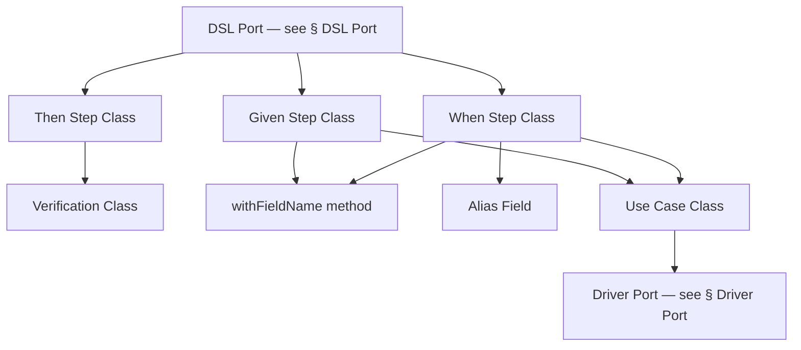
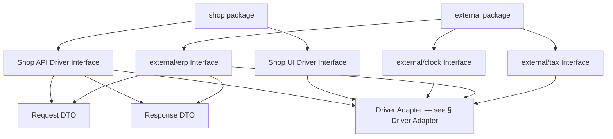
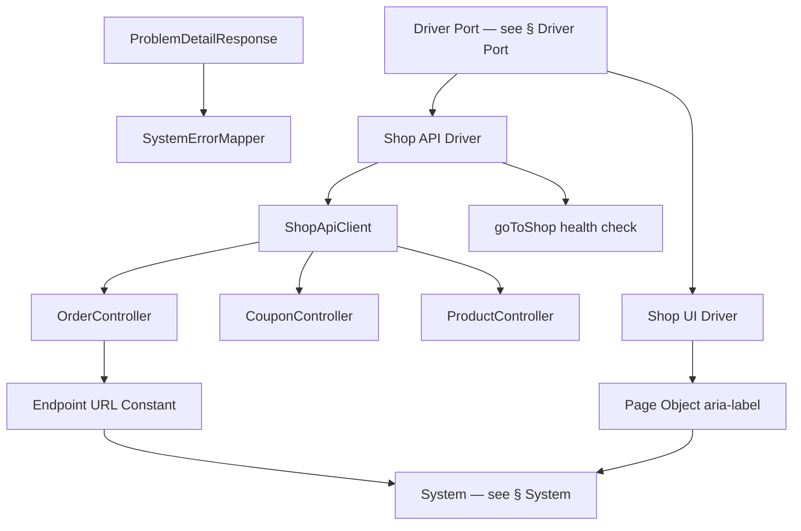
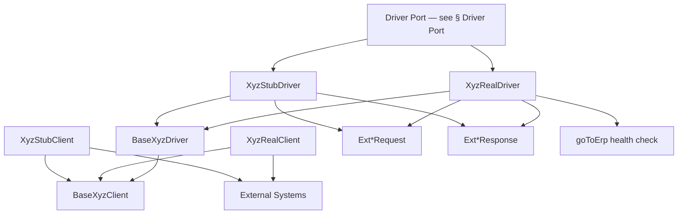
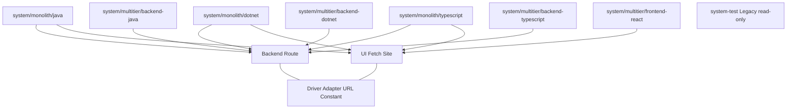

# Architecture Diagram

> Generated by the `diagram-generator` agent from the prose docs in `docs/atdd/architecture/`. Overwritten on every run — do not edit by hand; edit the source docs and regenerate.

## Source docs

- `docs/atdd/architecture/driver-adapter.md`
- `docs/atdd/architecture/driver-port.md`
- `docs/atdd/architecture/dsl-core.md`
- `docs/atdd/architecture/dsl-port.md`
- `docs/atdd/architecture/system.md`
- `docs/atdd/architecture/test.md`

## Overview

## Test

## DSL Port

## DSL Core

## Driver Port

## Driver Adapter — Shop Drivers

## Driver Adapter — External Drivers

## System

