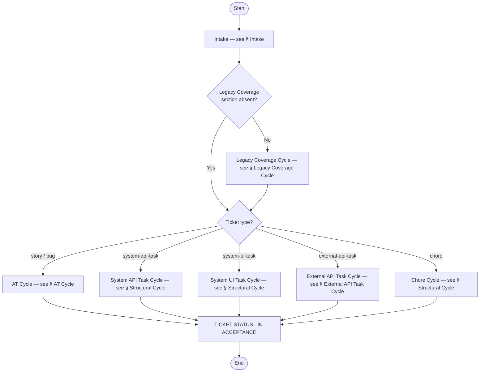
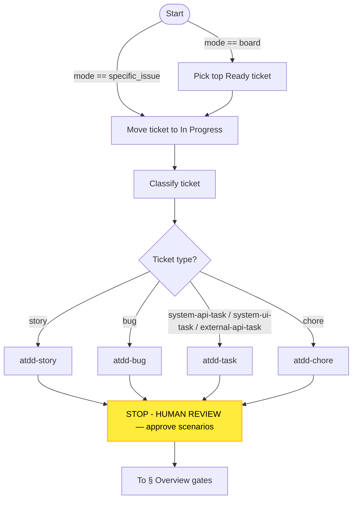
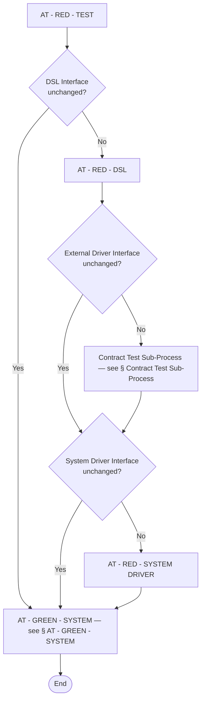
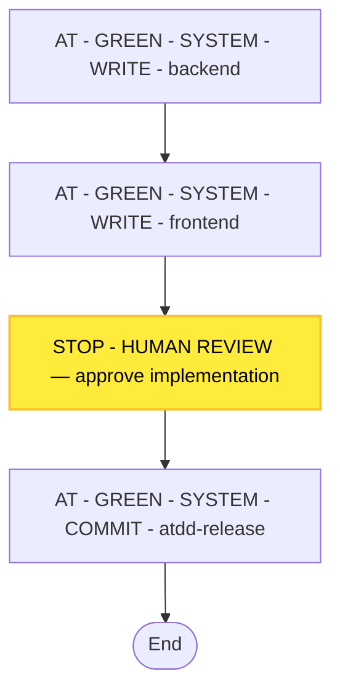
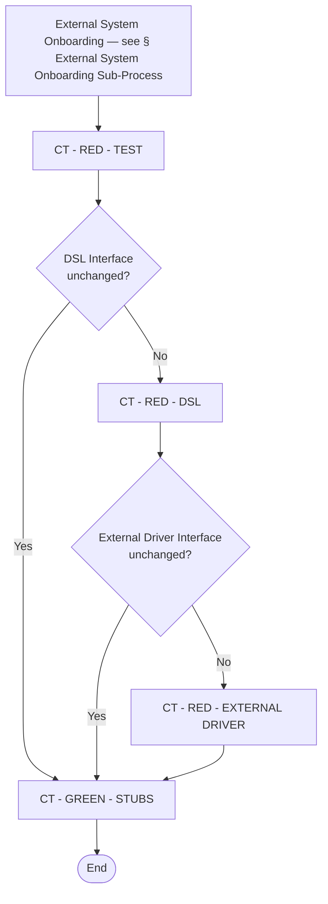
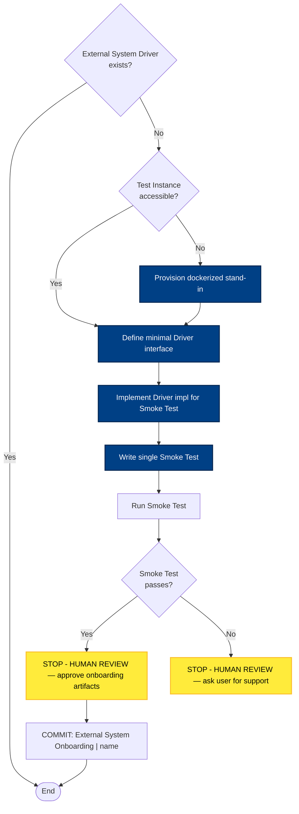
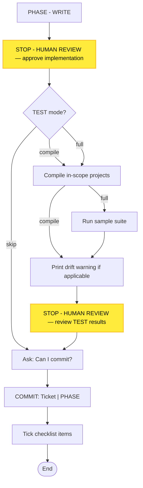
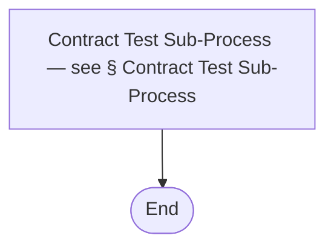
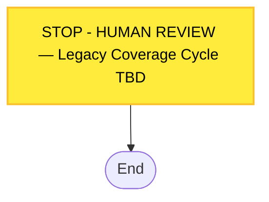

# Process Diagram

> Generated by the `diagram-generator` agent from the prose docs in `docs/atdd/process/` and the cycle-level orchestration YAML in `docs/atdd/process/process-flow.yaml`. Overwritten on every run — do not edit by hand; edit the source docs and regenerate.

## Source docs

- `docs/atdd/process/process-flow.yaml`
- `docs/atdd/process/at-cycle-conventions.md`
- `docs/atdd/process/at-green-system.md`
- `docs/atdd/process/at-red-dsl.md`
- `docs/atdd/process/at-red-system-driver.md`
- `docs/atdd/process/at-red-test.md`
- `docs/atdd/process/ct-cycle-conventions.md`
- `docs/atdd/process/ct-green-stubs.md`
- `docs/atdd/process/ct-red-dsl.md`
- `docs/atdd/process/ct-red-external-driver.md`
- `docs/atdd/process/ct-red-test.md`
- `docs/atdd/process/cycles.md`
- `docs/atdd/process/glossary.md`
- `docs/atdd/process/shared-commit-confirmation.md`
- `docs/atdd/process/shared-phase-progression.md`
- `docs/atdd/process/shared-ticket-status-in-acceptance.md`
- `docs/atdd/process/task-and-chore-cycles.md`

Per-phase WRITE / STOP / COMMIT mechanics for each AT and CT phase are in [diagram-phase-details.md](diagram-phase-details.md).

## Overview

## Intake

## AT Cycle

Per-phase mechanics for AT - RED - TEST, AT - RED - DSL, AT - RED - SYSTEM DRIVER, and AT - GREEN - SYSTEM are in [diagram-phase-details.md](diagram-phase-details.md).

## AT - GREEN - SYSTEM

Per-phase mechanics for the WRITE step are in [diagram-phase-details.md](diagram-phase-details.md). This subgraph shows the cycle-level orchestration across `atdd-backend`, `atdd-frontend`, the human-review STOP, and `atdd-release`.

## Contract Test Sub-Process

Per-phase mechanics for CT - RED - TEST, CT - RED - DSL, CT - RED - EXTERNAL DRIVER, and CT - GREEN - STUBS are in [diagram-phase-details.md](diagram-phase-details.md).

## External System Onboarding Sub-Process

## Structural Cycle

Shared by System API Task Cycle (phase suffix `SYSTEM API REDESIGN`), System UI Task Cycle (phase suffix `SYSTEM UI REDESIGN`), and Chore Cycle (phase suffix `CHORE`). The cycle's WRITE step is owned by `atdd-task` for system-api / system-ui subtypes and by `atdd-chore` for chores.

## External API Task Cycle

Thin wrapper — has no standalone WRITE / REVIEW / TEST / COMMIT; routes entirely through the Contract Test Sub-Process.

## Legacy Coverage Cycle

Internal phases TBD per `glossary.md` ("The Legacy Coverage Cycle's own internal phases are TBD"). The placeholder is a single human-review STOP so the runtime can dispatch something sensible until the spec lands.

