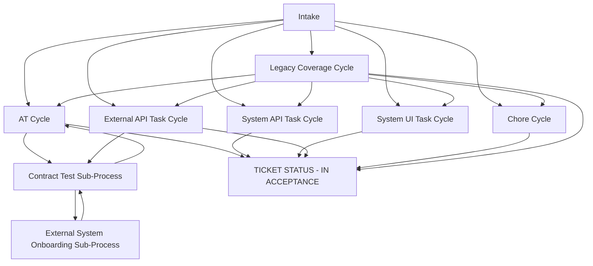
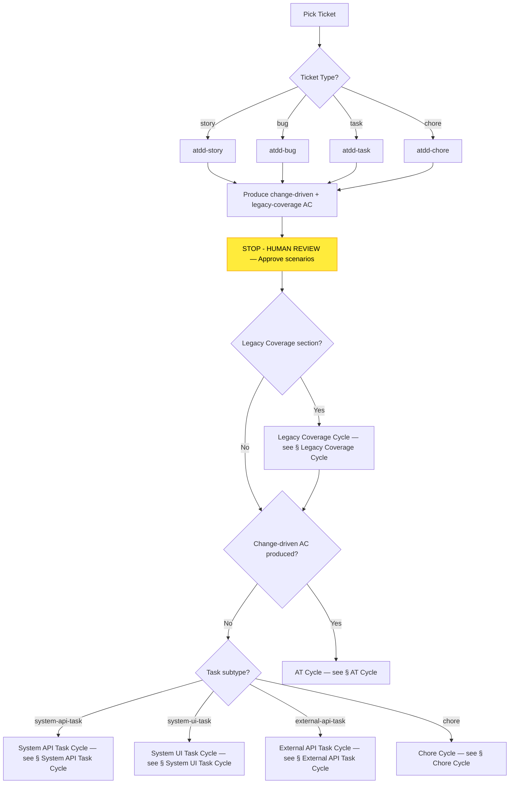
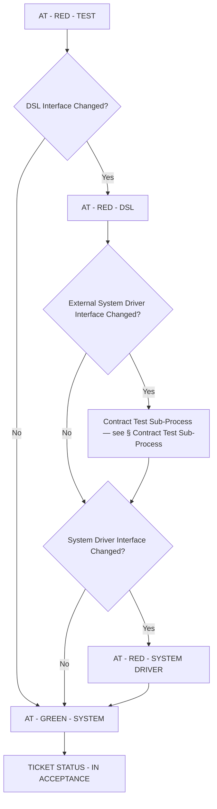
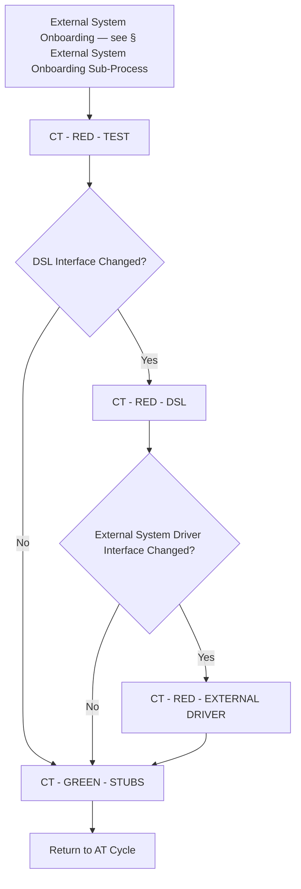
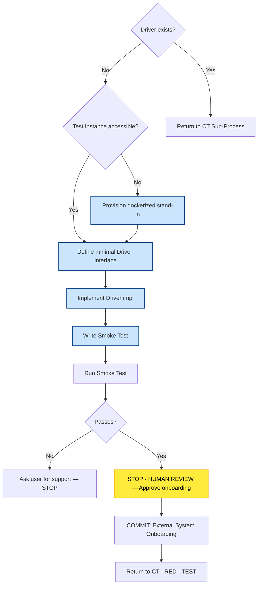
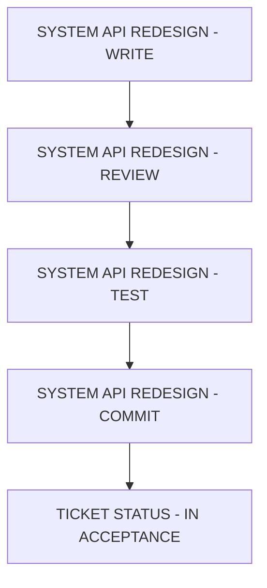
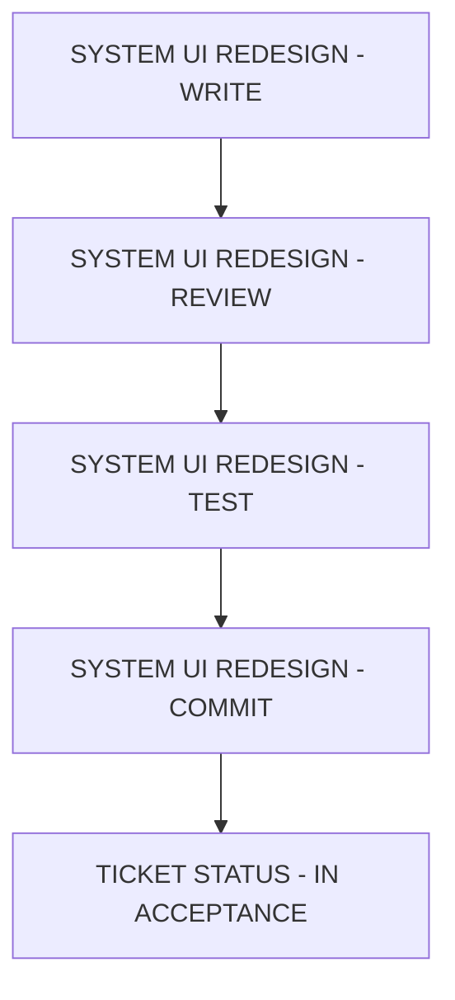
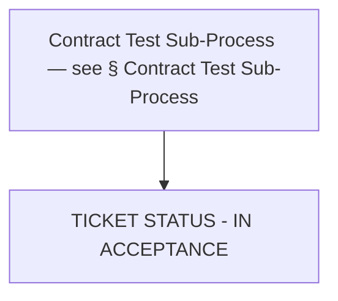
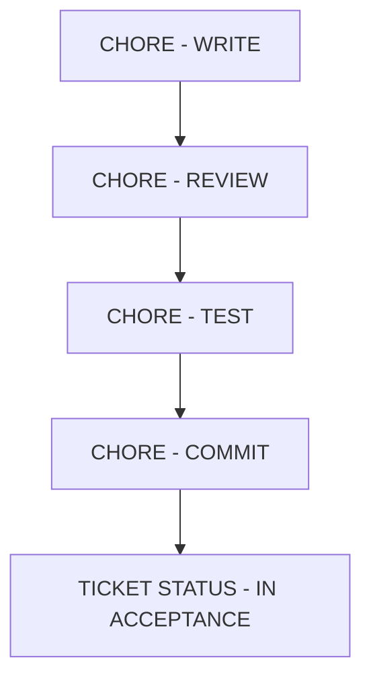
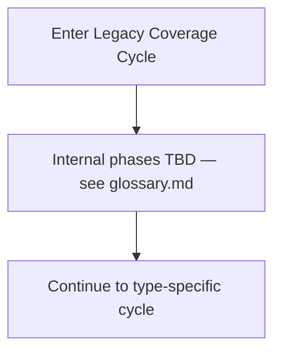

# Process Diagram

> Generated by the `diagram-generator` agent from the prose docs in `docs/atdd/process/`. Overwritten on every run — do not edit by hand; edit the source docs and regenerate.

## Source docs

- `docs/atdd/process/cycles.md`
- `docs/atdd/process/at-cycle-conventions.md`
- `docs/atdd/process/ct-cycle-conventions.md`
- `docs/atdd/process/at-red-test.md`
- `docs/atdd/process/at-red-dsl.md`
- `docs/atdd/process/at-red-system-driver.md`
- `docs/atdd/process/at-green-system.md`
- `docs/atdd/process/ct-red-test.md`
- `docs/atdd/process/ct-red-dsl.md`
- `docs/atdd/process/ct-red-external-driver.md`
- `docs/atdd/process/ct-green-stubs.md`
- `docs/atdd/process/task-and-chore-cycles.md`
- `docs/atdd/process/shared-phase-progression.md`
- `docs/atdd/process/shared-commit-confirmation.md`
- `docs/atdd/process/shared-ticket-status-in-acceptance.md`
- `docs/atdd/process/glossary.md`

## Overview

## Intake

## AT Cycle

Per-phase mechanics for AT - RED - TEST, AT - RED - DSL, AT - RED - SYSTEM DRIVER, AT - GREEN - SYSTEM are in [diagram-phase-details.md](diagram-phase-details.md).

## Contract Test Sub-Process

Per-phase mechanics for CT - RED - TEST, CT - RED - DSL, CT - RED - EXTERNAL DRIVER, CT - GREEN - STUBS are in [diagram-phase-details.md](diagram-phase-details.md).

## External System Onboarding Sub-Process

## System API Task Cycle

Per-phase mechanics for SYSTEM API REDESIGN are in [diagram-phase-details.md](diagram-phase-details.md).

## System UI Task Cycle

Per-phase mechanics for SYSTEM UI REDESIGN are in [diagram-phase-details.md](diagram-phase-details.md).

## External API Task Cycle

## Chore Cycle

Per-phase mechanics for CHORE are in [diagram-phase-details.md](diagram-phase-details.md).

## Legacy Coverage Cycle

