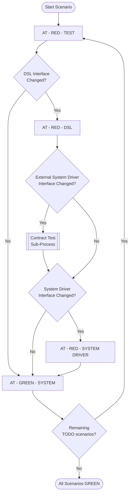
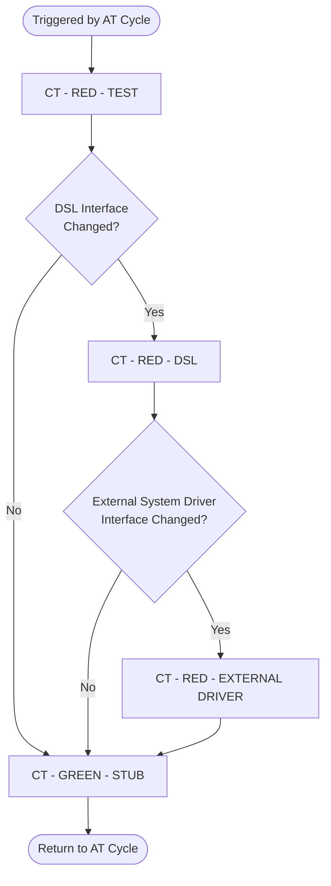
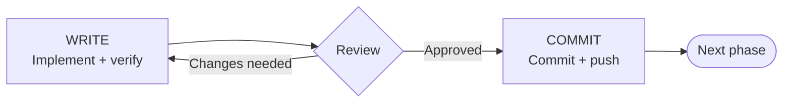

# ATDD Process Diagram

## AT Cycle (per scenario)

```mermaid
flowchart TD
    START([Start Scenario]) --> TEST[AT - RED - TEST]
    TEST --> DSL_CHK{DSL Interface\nChanged?}
    DSL_CHK -- No --> GREEN[AT - GREEN - SYSTEM]
    DSL_CHK -- Yes --> DSL[AT - RED - DSL]
    DSL --> EXT_CHK{External System Driver\nInterface Changed?}
    EXT_CHK -- Yes --> CT_SUB[[Contract Test\nSub-Process]]
    CT_SUB --> SYS_CHK
    EXT_CHK -- No --> SYS_CHK{System Driver\nInterface Changed?}
    SYS_CHK -- No --> GREEN
    SYS_CHK -- Yes --> SYS_DRV[AT - RED - SYSTEM DRIVER]
    SYS_DRV --> GREEN
    GREEN --> TODO_CHK{Remaining\nTODO scenarios?}
    TODO_CHK -- Yes --> TEST
    TODO_CHK -- No --> DONE([All Scenarios GREEN])
```

## Contract Test Sub-Process

```mermaid
flowchart TD
    CT_START([Triggered by AT Cycle]) --> CT_TEST[CT - RED - TEST]
    CT_TEST --> CT_DSL_CHK{DSL Interface\nChanged?}
    CT_DSL_CHK -- No --> CT_GREEN[CT - GREEN - STUB]
    CT_DSL_CHK -- Yes --> CT_DSL[CT - RED - DSL]
    CT_DSL --> CT_EXT_CHK{External System Driver\nInterface Changed?}
    CT_EXT_CHK -- No --> CT_GREEN
    CT_EXT_CHK -- Yes --> CT_DRV[CT - RED - EXTERNAL DRIVER]
    CT_DRV --> CT_GREEN
    CT_GREEN --> CT_DONE([Return to AT Cycle])
```

## Phase Details

Each phase follows a WRITE → COMMIT cycle:

```mermaid
flowchart LR
    WRITE[WRITE\nImplement + verify] --> REVIEW{Review}
    REVIEW -- Approved --> COMMIT[COMMIT\nCommit + push]
    REVIEW -- Changes needed --> WRITE
    COMMIT --> NEXT([Next phase])
```
