# Process Diagram

> Generated by the `diagram-generator` agent from the prose docs in `docs/atdd/process/`. Overwritten on every run — do not edit by hand; edit the source docs and regenerate.

## Source docs

- `docs/atdd/process/acceptance-tests.md`
- `docs/atdd/process/contract-tests.md`
- `docs/atdd/process/glossary.md`
- `docs/atdd/process/orchestrator.md`

## Overview

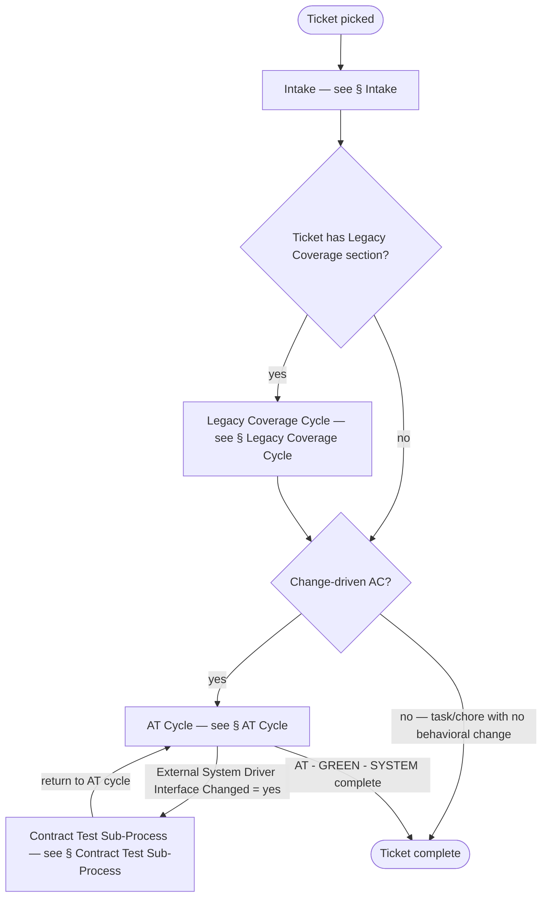

## Intake

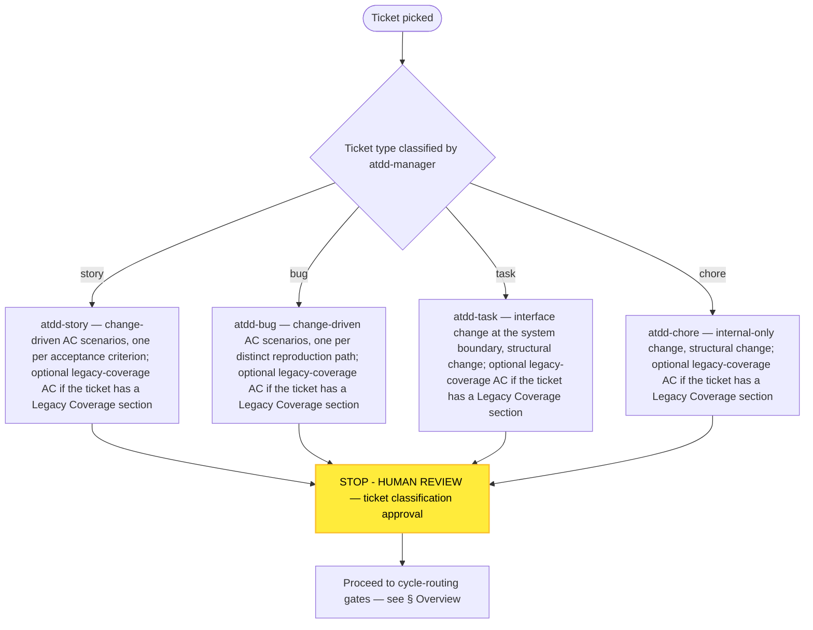

## AT Cycle

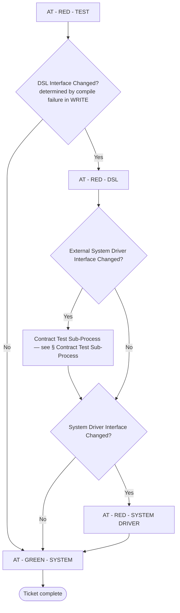

## AT - RED - TEST Phase Detail

**Goal:** every test in the scenario set compiles and fails only with runtime failure, then is marked as known-failing for the next phase.

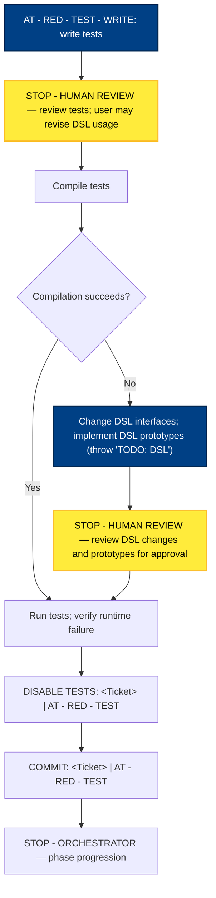

## AT - RED - DSL Phase Detail

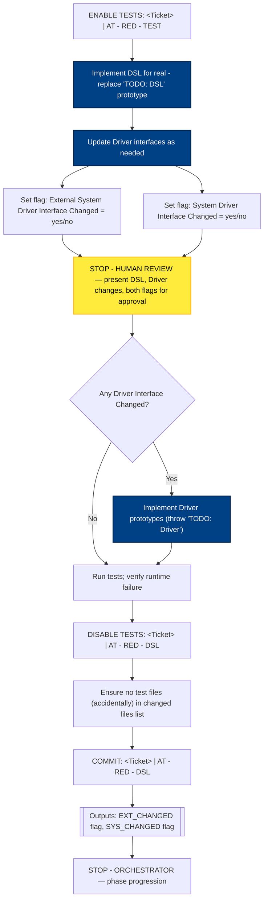

## AT - RED - SYSTEM DRIVER Phase Detail

**Notes:**
- Do NOT implement External Drivers — handled by the CT sub-process.
- Do NOT read system implementation source — model on existing driver methods.

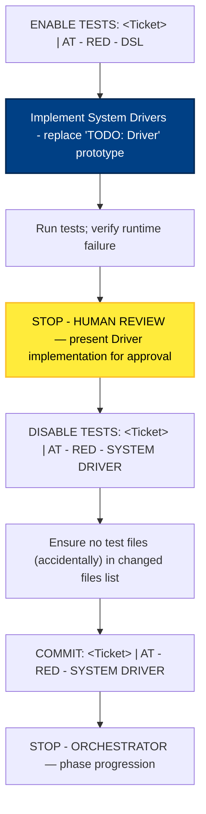

## AT - GREEN - SYSTEM Phase Detail

**Notes / Assumptions:**
- The agent has access to both backend and frontend code and works across the full stack — no silos like a human team. A single COMMIT therefore covers all implementation changes; the workflow does not split backend and frontend into separate commits.
- When fixing backend or frontend code, do NOT change tests, DSL, or drivers — only the system implementation.

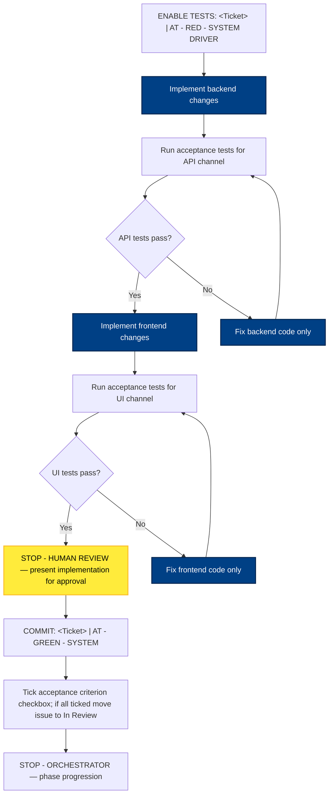

## Contract Test Sub-Process

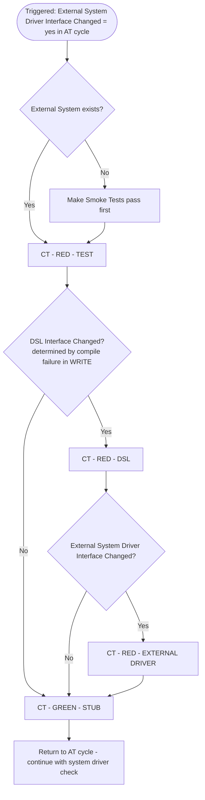

## CT - RED - TEST Phase Detail

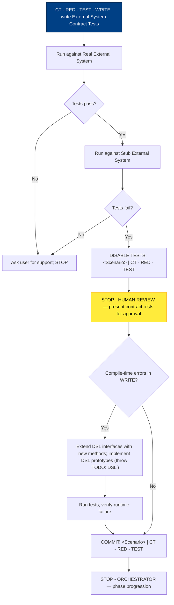

## CT - RED - DSL Phase Detail

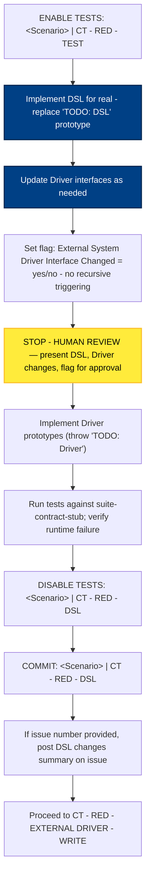

## CT - RED - EXTERNAL DRIVER Phase Detail

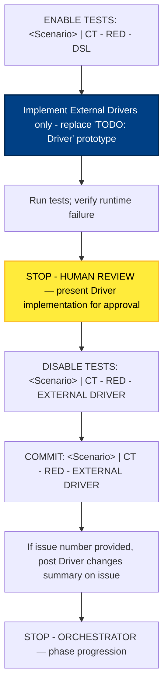

## CT - GREEN - STUBS Phase Detail

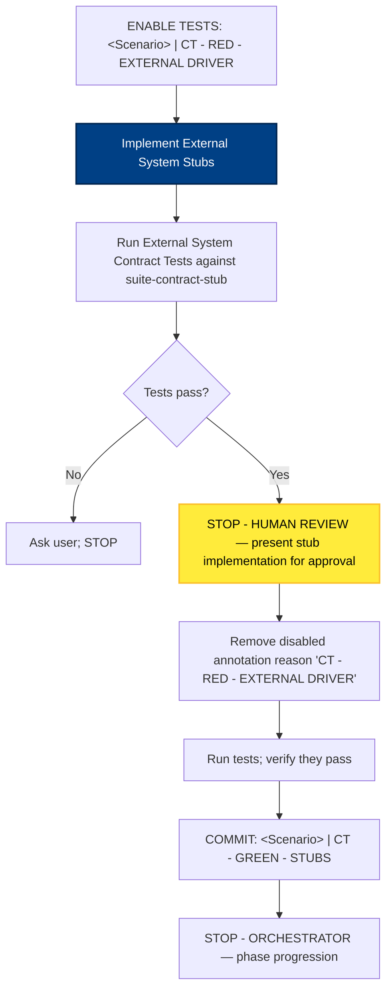

## Legacy Coverage Cycle

## Notes

- `orchestrator.md` shows the AT cycle's external-driver branch as `External System Driver Interface Changed? — Yes → Contract Test Sub-Process → (then continue ↓)` returning into the System Driver Interface check. The AT Cycle diagram routes the CT return edge into the `System Driver Interface Changed?` decision to match this prose; the No branch from `External System Driver Interface Changed?` flows into the same decision.
- `contract-tests.md` step 2 in CT - RED - TEST says "If they don't pass, ask the user for support. STOP." for the Real run, but for the Stub run only states "Verify that they fail" without an explicit branch for the unexpected case (Stub tests passing). The CT - RED - TEST detail diagram routes that anomaly to `ASK_USER` for completeness; this is an inferred edge.
