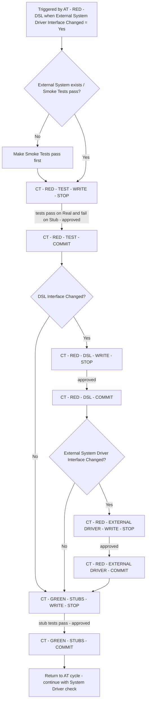

# Process Diagram

> Generated by the `diagram-generator` agent from the prose docs in `docs/atdd/process/`. Overwritten on every run — do not edit by hand; edit the source docs and regenerate.

## Source docs

- `docs/atdd/process/acceptance-tests.md`
- `docs/atdd/process/contract-tests.md`
- `docs/atdd/process/glossary.md`
- `docs/atdd/process/orchestrator.md`

## AT Cycle (per scenario)

```mermaid
flowchart TD
    INTAKE_CLASSIFY{Ticket type?}
    INTAKE_STORY[Intake - atdd-story - one scenario per acceptance criterion + Legacy Coverage - STOP]
    INTAKE_BUG[Intake - atdd-bug - one scenario per distinct reproduction path + Legacy Coverage - STOP]

    AT_RED_TEST_WRITE[AT - RED - TEST - WRITE - STOP]
    AT_RED_TEST_COMMIT[AT - RED - TEST - COMMIT]
    DSL_CHANGED{DSL Interface Changed?}

    AT_RED_DSL_WRITE[AT - RED - DSL - WRITE - STOP]
    AT_RED_DSL_COMMIT[AT - RED - DSL - COMMIT]
    EXT_DRIVER_CHANGED{External System Driver Interface Changed?}
    CT_SUBPROCESS[Contract Test Sub-Process - see CT diagram]
    SYS_DRIVER_CHANGED{System Driver Interface Changed?}

    AT_RED_SYSDRIVER_WRITE[AT - RED - SYSTEM DRIVER - WRITE - STOP]
    AT_RED_SYSDRIVER_COMMIT[AT - RED - SYSTEM DRIVER - COMMIT]

    AT_GREEN_SYSTEM_WRITE[AT - GREEN - SYSTEM - WRITE - STOP]
    AT_GREEN_SYSTEM_COMMIT[AT - GREEN - SYSTEM - COMMIT]

    SCENARIO_LOOP{Remaining // TODO: scenarios in test file?}
    DONE[All scenarios GREEN]

    INTAKE_CLASSIFY -->|story| INTAKE_STORY
    INTAKE_CLASSIFY -->|bug| INTAKE_BUG
    INTAKE_STORY -->|approved| AT_RED_TEST_WRITE
    INTAKE_BUG -->|approved| AT_RED_TEST_WRITE

    AT_RED_TEST_WRITE -->|approved| AT_RED_TEST_COMMIT
    AT_RED_TEST_COMMIT --> DSL_CHANGED
    DSL_CHANGED -->|No| AT_GREEN_SYSTEM_WRITE
    DSL_CHANGED -->|Yes| AT_RED_DSL_WRITE

    AT_RED_DSL_WRITE -->|approved| AT_RED_DSL_COMMIT
    AT_RED_DSL_COMMIT --> EXT_DRIVER_CHANGED
    EXT_DRIVER_CHANGED -->|Yes| CT_SUBPROCESS
    CT_SUBPROCESS --> SYS_DRIVER_CHANGED
    EXT_DRIVER_CHANGED -->|No| SYS_DRIVER_CHANGED
    SYS_DRIVER_CHANGED -->|No| AT_GREEN_SYSTEM_WRITE
    SYS_DRIVER_CHANGED -->|Yes| AT_RED_SYSDRIVER_WRITE

    AT_RED_SYSDRIVER_WRITE -->|approved| AT_RED_SYSDRIVER_COMMIT
    AT_RED_SYSDRIVER_COMMIT --> AT_GREEN_SYSTEM_WRITE

    AT_GREEN_SYSTEM_WRITE -->|approved| AT_GREEN_SYSTEM_COMMIT
    AT_GREEN_SYSTEM_COMMIT --> SCENARIO_LOOP
    SCENARIO_LOOP -->|Yes| AT_RED_TEST_WRITE
    SCENARIO_LOOP -->|No| DONE
```

## Contract Test Sub-Process

## Notes

- The orchestrator prose explicitly states "No recursive triggering" for the CT cycle's own `External System Driver Interface Changed?` flag (`contract-tests.md` CT - RED - DSL - WRITE step 4 and `orchestrator.md` CT sub-process); both Yes and No branches therefore route within the CT sub-process only and do not re-enter CT.
- STOP gates render as edges labelled `approved` because every WRITE phase ends with STOP (per `acceptance-tests.md` and `orchestrator.md` "STOP Behaviour"); the diamond branching for autonomous vs normal mode is not modelled because both modes follow the same edge — only the approval mechanism differs.
- `acceptance-tests.md` AT - RED - TEST - WRITE step 3 says "STOP. Present the tests to the user and ask for approval" but the orchestrator's AT cycle box does not explicitly draw the AT - RED - TEST internal compile-success vs compile-failure branch; the diagram reflects the orchestrator-level flow and omits the internal compile-error fallback to keep one concept per file.
