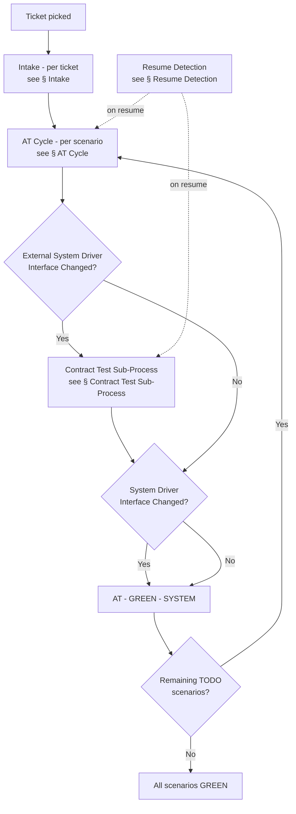
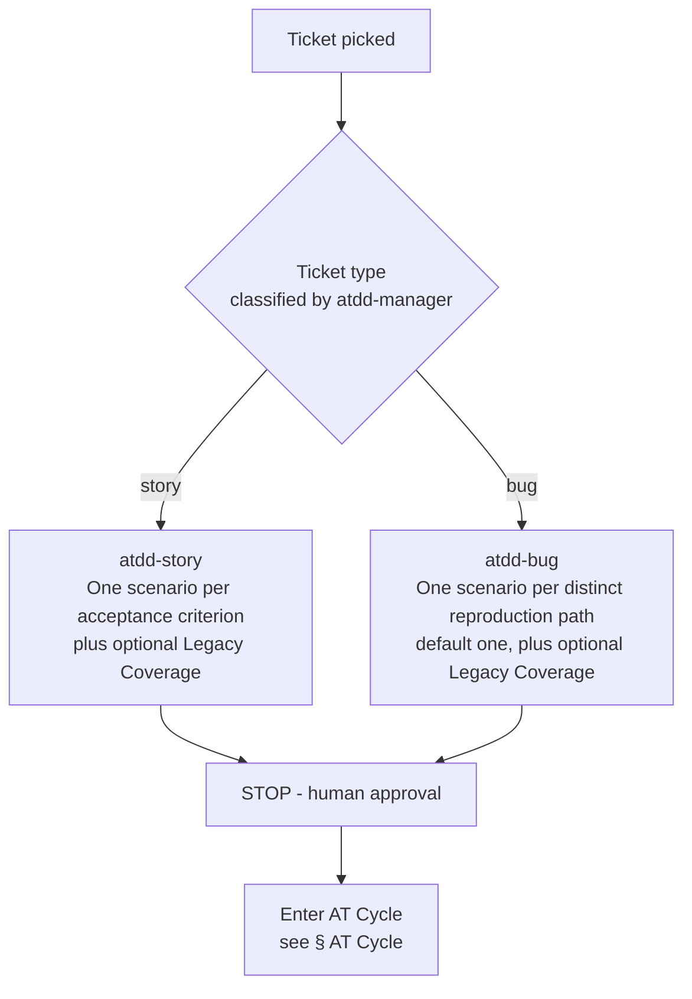
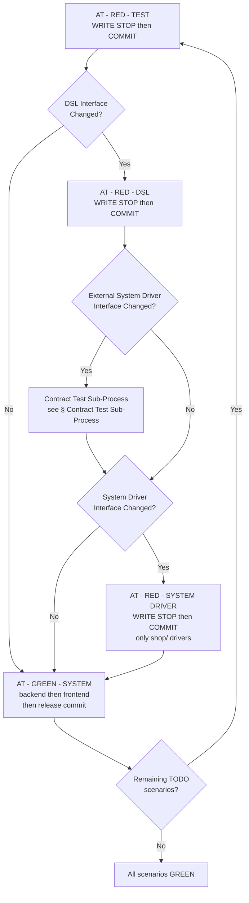
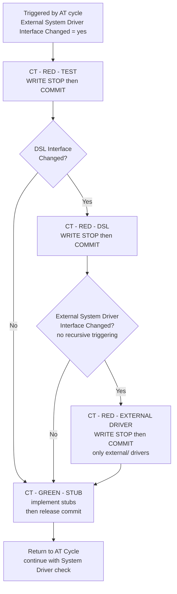
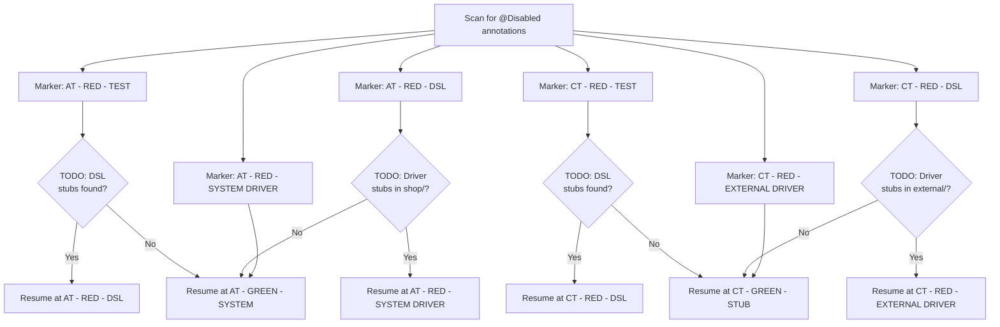

# Process Diagram

> Generated by the `diagram-generator` agent from the prose docs in `docs/atdd/process/`. Overwritten on every run — do not edit by hand; edit the source docs and regenerate.

## Source docs

- `docs/atdd/process/glossary.md`
- `docs/atdd/process/acceptance-tests.md`
- `docs/atdd/process/contract-tests.md`
- `docs/atdd/process/orchestrator.md`

## Overview

## Intake

## AT Cycle

## Contract Test Sub-Process

## Resume Detection

## Notes

- The orchestrator prose (`orchestrator.md` &sect; AT Cycle) places the External Driver decision *between* AT - RED - DSL and the System Driver decision, with the Contract Test Sub-Process running on Yes and then *continuing* into the System Driver check. The acceptance-tests prose (`acceptance-tests.md` AT - RED - DSL - WRITE) records both flags simultaneously without specifying ordering. The Overview and AT Cycle diagrams follow the orchestrator's explicit ordering.
- `acceptance-tests.md` AT - RED - DSL - COMMIT step 7 says it "Automatically proceed[s] to AT - RED - SYSTEM DRIVER - WRITE", but the orchestrator gates that step on `System Driver Interface Changed = yes`. The diagrams follow the orchestrator's gating.
- The orchestrator phase table names the final CT phase `CT - GREEN - STUB` (singular); `contract-tests.md` headings name it `CT - GREEN - STUBS` (plural). The diagrams use `CT - GREEN - STUB` to match the orchestrator's flow diagram, which is the source of process structure.
