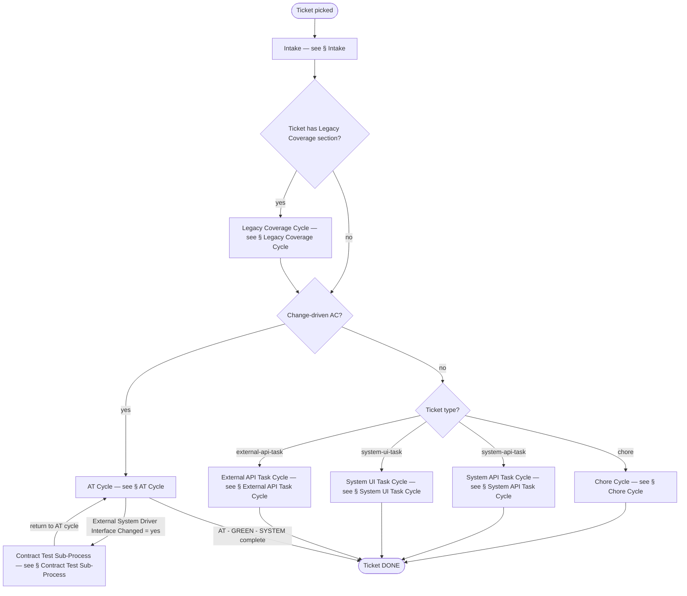
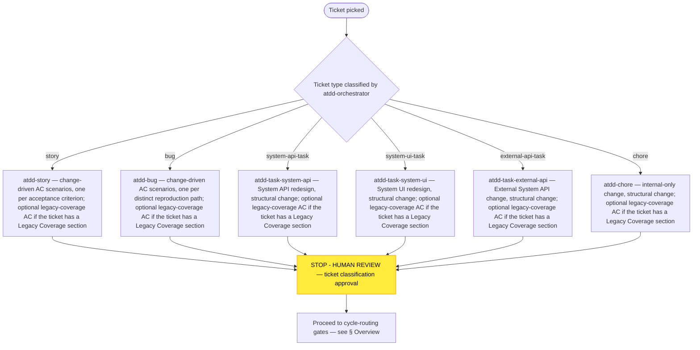
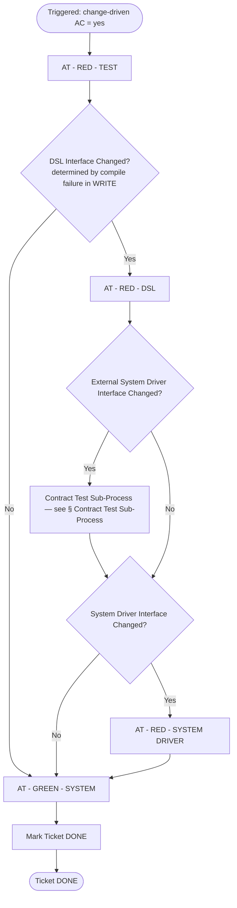
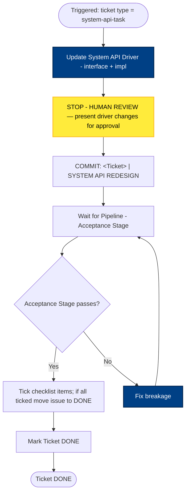
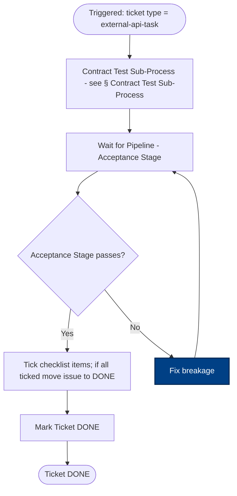
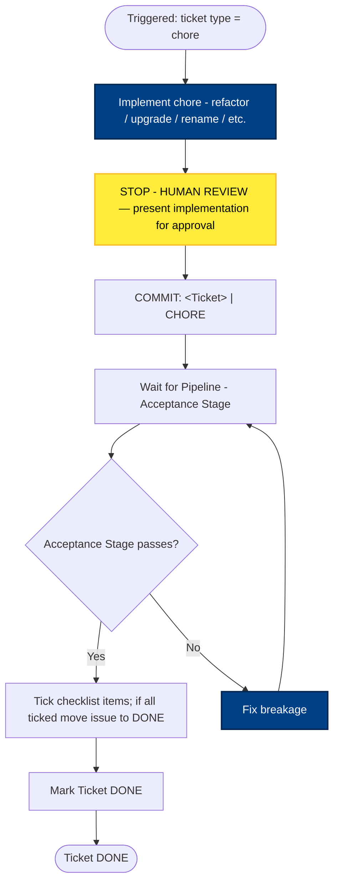
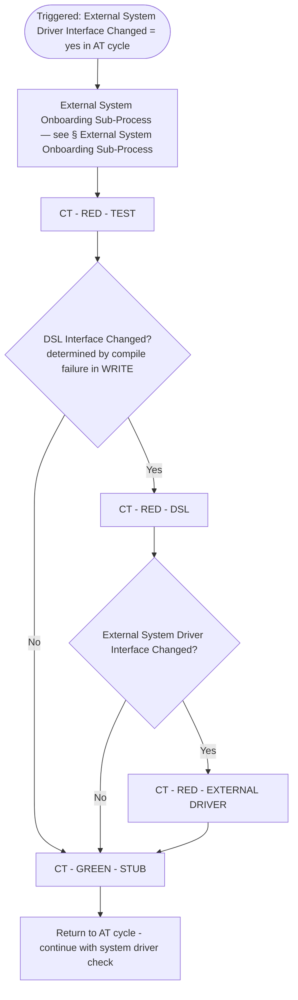
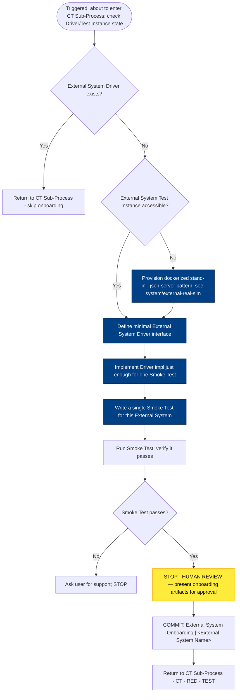
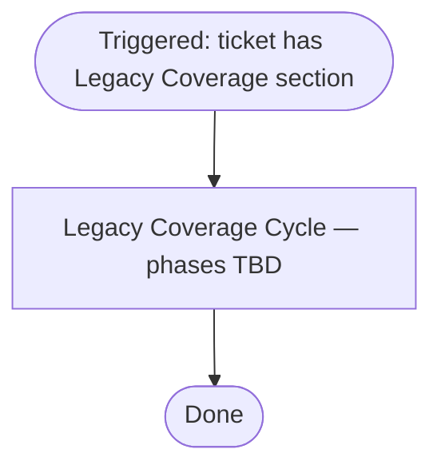

# Process Diagram

> Generated by the `diagram-generator` agent from the prose docs in `docs/atdd/process/`. Overwritten on every run — do not edit by hand; edit the source docs and regenerate.
>
> This file holds the cycle-level flow (Overview, Intake, AT Cycle, Contract Test Sub-Process, External System Onboarding Sub-Process, Legacy Coverage Cycle). The per-phase WRITE / STOP - HUMAN REVIEW / COMMIT mechanics for every AT and CT phase live in [`phase-details-diagram.md`](phase-details-diagram.md).

## Source docs

- `docs/atdd/process/acceptance-tests.md`
- `docs/atdd/process/contract-tests.md`
- `docs/atdd/process/glossary.md`
- `docs/atdd/process/cycles.md`

## Overview

## Intake

## AT Cycle

Per-phase mechanics for `AT - RED - TEST`, `AT - RED - DSL`, `AT - RED - SYSTEM DRIVER`, and `AT - GREEN - SYSTEM` are in [`phase-details-diagram.md`](phase-details-diagram.md).

## System API Task Cycle

## System UI Task Cycle

## External API Task Cycle

## Chore Cycle

## Contract Test Sub-Process

Per-phase mechanics for `CT - RED - TEST`, `CT - RED - DSL`, `CT - RED - EXTERNAL DRIVER`, and `CT - GREEN - STUBS` are in [`phase-details-diagram.md`](phase-details-diagram.md).

## External System Onboarding Sub-Process

## Legacy Coverage Cycle

## Notes

- `cycles.md` shows the AT cycle's external-driver branch as `External System Driver Interface Changed? — Yes → Contract Test Sub-Process → (then continue ↓)` returning into the System Driver Interface check. The AT Cycle diagram routes the CT return edge into the `System Driver Interface Changed?` decision to match this prose; the No branch from `External System Driver Interface Changed?` flows into the same decision.
- `contract-tests.md` step 2 in CT - RED - TEST says "If they don't pass, ask the user for support. STOP." for the Real run, but for the Stub run only states "Verify that they fail" without an explicit branch for the unexpected case (Stub tests passing). The CT - RED - TEST detail diagram in `phase-details-diagram.md` routes that anomaly to `ASK_USER` for completeness; this is an inferred edge.
