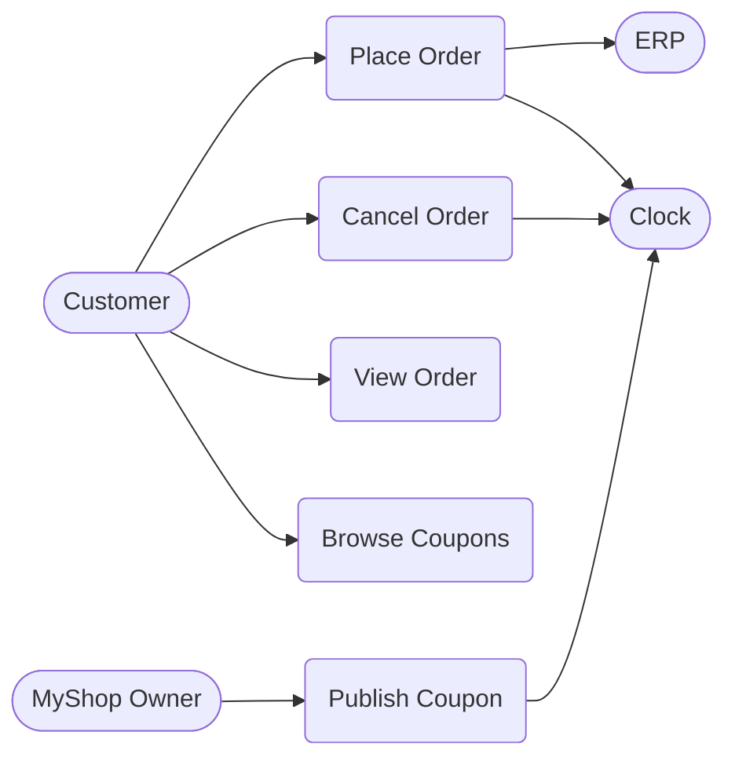

# MyShop — Use Cases

```mermaid
graph LR
    Customer([Customer])
    Seller([MyShop Owner])
    ERP([ERP])
    Clock([Clock])

    Customer --> PlaceOrder(Place Order)
    Customer --> CancelOrder(Cancel Order)
    Customer --> ViewOrder(View Order)
    Seller --> PublishCoupon(Publish Coupon)
    Customer --> BrowseCoupons(Browse Coupons)

    PlaceOrder --> ERP
    PlaceOrder --> Clock
    CancelOrder --> Clock
    PublishCoupon --> Clock
```
